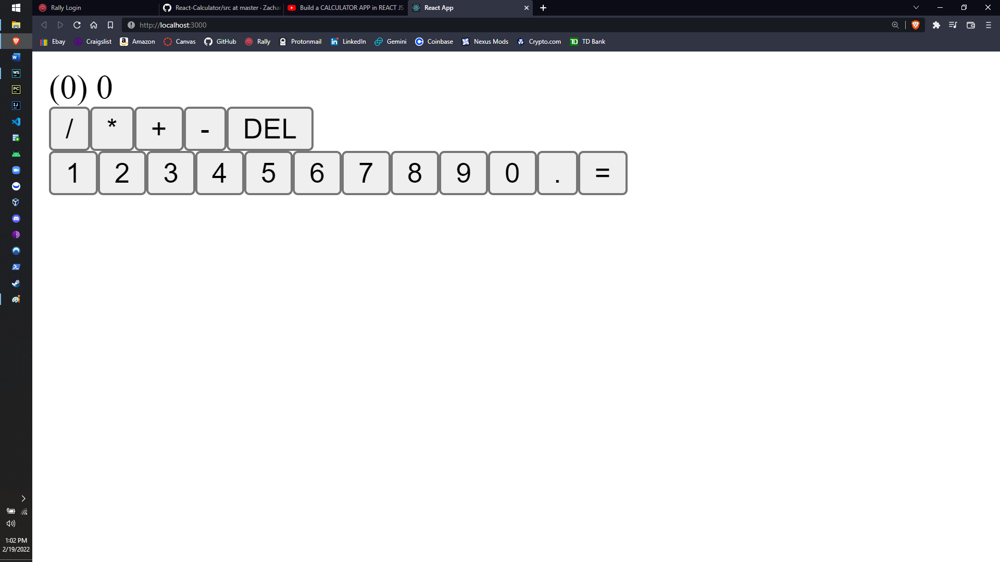

# Calculator Web-Application in React (JavaScript Framework)
The purpose of this project is to practice and get familiar using React for an upcoming capstone project.
This is a basic calculator web-application on the React JavaScript framework, and is being developed using 
WebStorm, a JetBrains JavaScript IDE. Throughout the development of this web-application, activities will be
logged using this README.MD file as documentation for the process itself, and will be updated with each commit
to Github.com using the resources available from an online YouTube tutorial on the React environment.
The link to the video is https://www.youtube.com/watch?v=oiX-6Y2oGjI

### Initialization
Firstly, the project itself must be created, and some changes need to be done to make the project ready for
development, deleting a few initial files and removing invocations of those files within other files. For the
last part of this step, as always, make it a 'Hello World' banner to make it official.
1. Create the project, named 'React-Calculator' which is a React Project
2. Delete some initial files generated during project initialization, and make changes to others
   1. App.test (Delete)
   2. App.css (Delete)
   3. Logo.svg (Delete)
   4. ReportWebVitals.js (Delete)
   5. SetupTests.js (Delete)
   6. Index.js (Remove instance of ReportWebVitals)
   7. App.js (Remove import statements for Logo and App.css, and everything inside of App class)
3. Remove all contents from Index.css, will be added to later on
4. Finally, add the Hello World banner to the App class in App.js

### Development Part 1 (HTML setup)
This section is the HTML initialization of the project, creating the buttons that will be interacted with
by the user, as well as setting up the classes that will be manipulated using the css files in the project.
1. Type 'npm start' in WebStorm terminal, load up the React Development Server
2. Create 'calculator' class and a 'display' and 'operators' class within calculator
3. Create 4 buttons within the 'operators' class (+, -, *, /)
4. Create a 'Digits' class
5. Write function to generate digit buttons (1, 2, 3, 4, 5, 6, 7, 8, 9)
6. Invoke function within digits class

On the client side, this is what the project looks like so far, it lacks formatting that will be added in
as the development phase proceeds.
